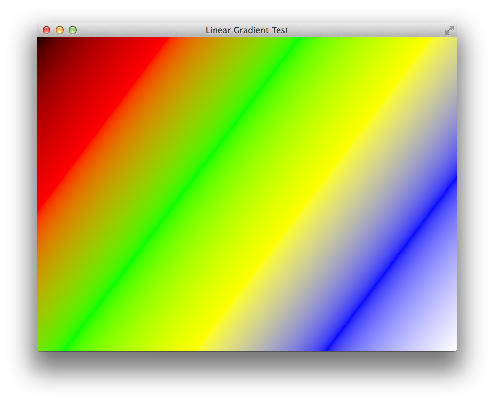
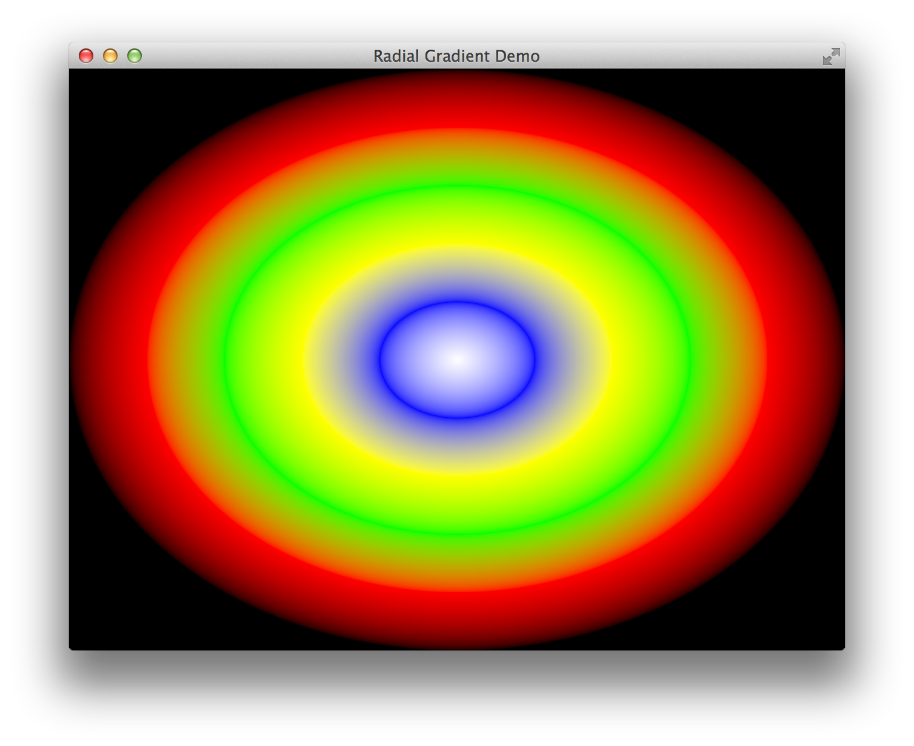
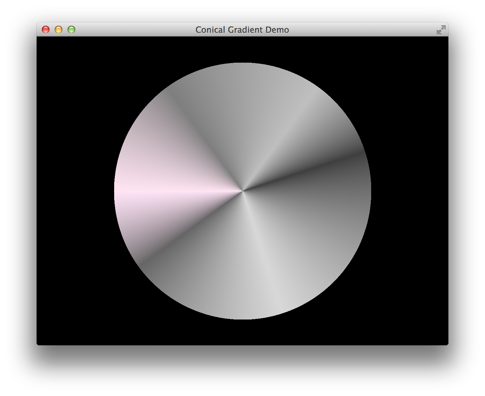

# Window class

The `Window` class (the type of objects returned by `OpenWindow()`)
has the following methods:

    nil refresh()

Actually renders the backing memory buffer to the screen and updates
the window. Don't call this in a tight loop! (only once per frame)

    nil setColor(number r, number g, number b, number a)

Sets the current drawing color of the window in RGBA format. All
parameters are floating-point numbers between 0 and 1.

    hashmap getColor()

Returns a hashmap with keys `r`, `g`, `b`, `a`. The values are
normalized ([0...1]) floating-point numbers.

    nil setBlendMode(string mode)

Sets the current drawing blend mode in order to specify how the
alpha channel is used. `mode` is one of SDL's four Blend Modes:
`"none"`, `"blend"`, `"add"` or `"mod"`.

    string getBlendMode()

Returns the name of the current blend mode.

    nil setFont(string name, number ptsize, string style)

Sets the active font for text rendering. `name` is the name of the font,
it will be used for constructing the font file name to be loaded (by
appending the string `.ttf` to it). `ptsize` is the font size in points,
where 72 points = 1 inch. `style` is a whitespace-separated list that
consists of any of the following substrings:

 - `normal`
 - `bold`
 - `italic`
 - `underline`
 - `strikethrough`

<!-- commity-comment -->

### Drawing primitives

    nil clear()

Fills the entire window with the current drawing color.

    nil strokeRect(x, y, w, h)
    nil fillRect(x, y, w, h)

Draw a rectangle outline or a filled rectangle, respectively,
at coordinates (x, y) of size (w, h).

    nil strokeArc(x, y, r, start, stop)
    nil fillArc(x, y, r, start, stop)

Stroke or fill an arc with center point (x, y), radius r, starting
angle start and end angle stop. Angles are measured in radians.

    nil strokeEllipse(x, y, rx, ry)
    nil fillEllipse(x, y, rx, ry)

Draw an ellipse with center point (x, y), horizontal semi-axis rx
and vertical semi-axis ry.

    nil fillPolygon(x1, array coords)

Fills the polygon enclosed by the points at coordinates `(x1, y1)`,
`(x2, y2)`, `(x3, y3)`, etc., where `x1, y1, x2, y2`, etc. are
consecutive numbers in the `coords` array.
At least 3 points (6 coordinates) must be specified.

    nil strokeRoundedRect(x, y, w, h, r)
    nil fillRoundedRect(x, y, w, h, r)

same as `strokeRect()` and `fillRect()`, except the corners of the
rectangles will be rounded, with radius `r`.

    nil bezier(integer steps, array coords)

Draws a Bezier curve through the specified points, using `steps` steps
to interpolate between two consecutive points. `steps` must be at least
2, the number of points must be at least 3. The coordinates are specified
using the `coords` array. Every element of the array must be a number;
pairs of consecutive numbers are the X and Y coordinates of the next
point of the curve, i. e. `[x1, y1, x2, y2, x3, y3, ...]`

    nil line(x, y, dx, dy)

Draws a line starting at point (x, y), moving along the vector (dx, dy).

    nil point(x, y)

Draw a single pixel at point (x, y)

    Texture renderText(string text, boolean hq)

Renders the string `text` using the current drawing color and current
font. if `hq` is `true`, the rendering will be higher-quality but slower
than if it was `false`. Returns the texture with the rendered text.
(this function does not actually do drawing -- in order to blit the
resulting texture to the window, use `renderTexture()`.)
This function raises a runtime error if currently there's no font set
in the window.

    hashmap textSize(string text)

Returns a hashmap with keys `width` and `height` which are integers
specifying the size of the given `text` rendered using the current
font. (No actual rendering is done, only the computation of the
font size is carried out using kerning.) Raises a runtime error if
there's no font set in the window currently.

    nil renderTexture(Texture texture, x, y)

Blits the contents of `texture` at point `(x, y)` to the window.

    [ Image | nil ] loadImage(string filename)

Loads the file at `filename` into memory. Returns the
resulting texture object on success and `nil` on error.

    nil linearGradient(w, h, dx, dy, array colorStops)

Draws a linear gradient inside a rectangle of size `w * h`.
and returns the resulting texture. `dx` and `dy` are components of the
direction vector of the line along which you wish to draw the
gradient. `colorStops` is an array of hashmaps. Each element of
the array must have at least the following keys-value pairs:

 - `r`, `g`, `b`, `a`: normalized (1…0) (usually floating-point)
   components of the color at the corresponding color-stop point.
 - `p` is the normalized progress/ratio of the color stop object,
   also a number between 0 and 1.

There must be at least 2 color-stop points. Here's how such a
linear gradient looks like:

<!-- commity comment -->

    nil radialGradient(rx, ry, array colorStops)
    nil conicalGradient(rx, ry, array colorStops)

These functions draw a radial or conical gradient, respectively.
`cx` and `cy` are the coordinates of the enclosing ellipse.
`rx` and `ry` are the horizontal and vertical semi-axes thereof.
`colorStops` have the same purpose and layout as discussed above.
The returned texture object can be rendered using `renderTexture()`.

Here's an example of a radial gradient:

And a conical one:

<!-- commity comment -->

	[ int | nil ] showMessageBox(string flag, string title, string msg [, hashmap buttons])

Shows a message box with the given data:

* `flag` : Must be one of the following (failing to pick one defaults to `"error"`!):
	- `"error"`
	- `"warning"`
	- `"information"` (also accepts `"info"`)
* `title` : The title of the message box
* `msg` : The message to display in the box
* `buttons` : A hashmap where the key is the contents of the button, and the value
must be one of the following:
	- `"return"`, which defaults the Enter key to the corresponding button
	- `"escape"`, which defaults the Esc key to the corresponding button

<!-- commity comment -->
